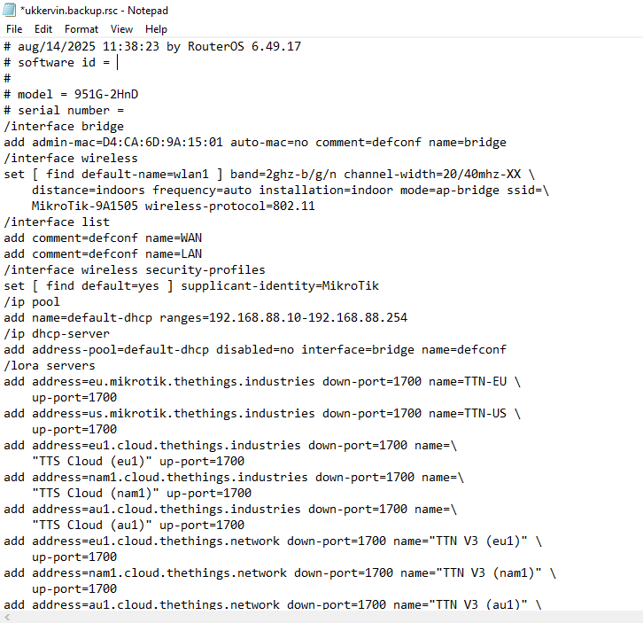

# LAB-12-Export-dan-Import-pada-mikrotik
tanggal 14 agustus 2025

# export dan import pada mikrotik 
Ekspor dan impor konfigurasi pada MikroTik memungkinkan Anda untuk menyimpan pengaturan perangkat dan memindahkannya  
ke perangkat lain atau mengembalikannya jika terjadi masalah. Ekspor menghasilkan file teks (.rsc)  
yang berisi perintah RouterOS, sedangkan impor menjalankan perintah tersebut pada perangkat.  
ada tambahan fungsi menarik di fitur export/import. Yakni fungsi Compact. Dengan fungsi ini,  
maka hanya konfigurasi yang ditambahkan secara manual yang akan ditampilkan atau disimpan.  
Maka perintah export import bisa dita tulis begini.  

        export compact file="backupan"
        import file-name="backupan"
        
file dengan ekstensi *.rsc. Kita bisa download, kemudian membuka dan mengedit file tersebut dengan text editor.  
Berbeda dengan file backup yang berupakan file binary yang tidak bisa dibaca jika dibuka dengan aplikasi text editor.  
Hasil filenya jika dibuka di notepad akan seperti ini.

Perlu diketahui, perintah export tidak menyimpan konfigurasi user dan password internal MikrotikOS.  
Export bisa digunakan untuk menampilkan konfigurasi salah satu fitur tertentu,  
tanpa harus menampilkan semua konfigurasi router.    
# kesimpulan 
Export dan Import pada MikroTik adalah metode praktis untuk mencadangkan dan menerapkan konfigurasi.  
Export menyimpan konfigurasi dalam bentuk teks, dan Import menjalankannya kembali ke router lain atau setelah reset.
